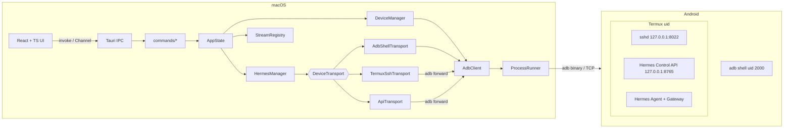
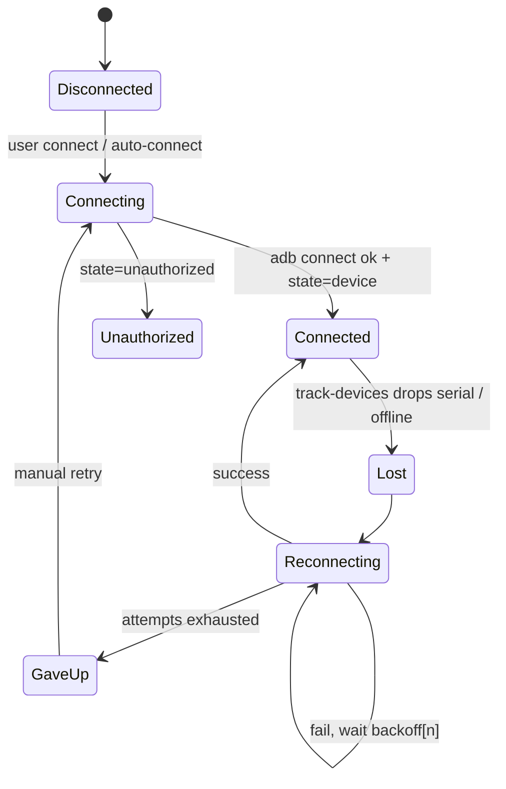
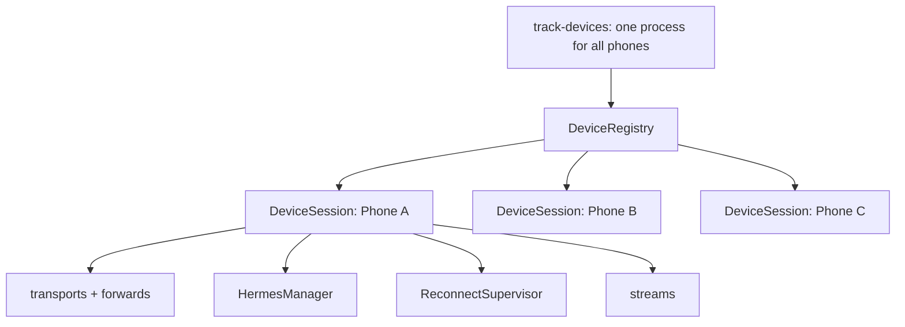

# Architecture

## 1. Overview



Key rules:

- **Only `ProcessRunner` spawns processes.** Only `AdbClient` builds `adb` argv. No `Command::new("adb")` anywhere else.
- **UI never knows the transport.** It calls `execute_command`, `start_hermes`, `start_log_stream` and receives the same types regardless of ADB/SSH/API.
- **Everything is keyed by device.** No global "current device" in the backend; the UI holds the active tab. Multiple phones are first-class (see §11).

## 2. Repository layout

```
.
├── package.json                # npm (only package manager)
├── vite.config.ts
├── tsconfig.json
├── index.html
├── src/                        # React frontend
│   ├── main.tsx
│   ├── App.tsx
│   ├── app/                    # layout, router, providers
│   ├── features/
│   │   ├── dashboard/
│   │   ├── device/
│   │   ├── hermes/
│   │   ├── terminal/
│   │   ├── logs/
│   │   └── settings/
│   ├── components/             # shared UI primitives (Button, Card, StatusDot, Dialog, ErrorPanel)
│   ├── lib/
│   │   ├── ipc.ts              # typed invoke wrappers (single place calling @tauri-apps/api)
│   │   ├── streams.ts          # Channel helpers
│   │   └── format.ts
│   ├── stores/                 # zustand stores
│   ├── types/generated/        # ts-rs output (do not edit)
│   └── test/                   # vitest setup, IPC mocks
└── src-tauri/
    ├── Cargo.toml
    ├── tauri.conf.json
    ├── capabilities/default.json
    └── src/
        ├── main.rs             # calls lib::run()
        ├── lib.rs              # builder, plugins, command registration
        ├── error.rs            # AppError
        ├── state.rs            # AppState
        ├── config/             # AppConfig, HermesConfig, persistence
        ├── process/            # ProcessRunner trait + TokioRunner + FakeRunner (tests)
        ├── adb/
        │   ├── mod.rs
        │   ├── locate.rs       # adb path detection
        │   ├── client.rs       # AdbClient (argv builders + exec)
        │   ├── parse.rs        # devices -l, getprop, dumpsys battery, df, meminfo
        │   ├── device.rs       # AndroidDevice, DeviceState, DeviceInfo
        │   ├── tracker.rs      # track-devices + reconnect/backoff
        │   └── logs.rs         # logcat source
        ├── transport/
        │   ├── mod.rs          # DeviceTransport trait, CommandResult, CommandStream
        │   ├── adb_shell.rs
        │   ├── termux_ssh.rs   # M4
        │   └── api.rs          # M8
        ├── hermes/
        │   ├── mod.rs
        │   ├── manager.rs
        │   ├── status.rs       # parsing
        │   └── api.rs          # Control API client types
        ├── logs/
        │   ├── mod.rs          # LogSource trait, LogLine, level detection
        │   └── batcher.rs
        ├── streams.rs          # StreamRegistry (id → cancel handle)
        ├── provision/          # M11: steps, plan runner, recipes, bootstrap.sh template
        └── commands/
            ├── mod.rs
            ├── adb.rs          # detect_adb, adb_version
            ├── device.rs
            ├── hermes.rs
            ├── terminal.rs
            ├── logs.rs
            └── settings.rs
```

`android/hermes-control/` (M8) holds the Termux-side service and install script.

## 3. Core Rust types

```rust
// error.rs — serialized to the UI as { kind, message, details }
#[derive(Debug, thiserror::Error, Serialize, TS)]
#[serde(tag = "kind", content = "data")]
pub enum AppError {
    AdbNotFound { searched: Vec<String> },
    AdbFailed { message: String, stderr: String, exit_code: Option<i32> },
    DeviceOffline { serial: String },
    DeviceUnauthorized { serial: String },
    DeviceNotFound { serial: String },
    ConnectionRefused { address: String },
    WirelessDebuggingDisabled { address: String },
    TermuxUnavailable { reason: String },
    HermesNotFound,
    CommandFailed { command: String, exit_code: Option<i32>, stderr: String },
    Timeout { operation: String, after_ms: u64 },
    Config(String),
    Io(String),
}

#[derive(Serialize, Deserialize, Clone, TS)]
pub enum DeviceState { Device, Offline, Unauthorized, Connecting, Disconnected, Unknown(String) }

#[derive(Serialize, Clone, TS)]
pub struct AndroidDevice {
    pub serial: String,               // "192.168.1.25:42567" or USB serial; may change for wireless
    pub device_id: Option<String>,    // stable: ro.serialno → ro.boot.serialno → android_id
    pub model: Option<String>,
    pub product: Option<String>,
    pub transport_id: Option<String>,
    pub ip_address: Option<String>,
    pub state: DeviceState,
    pub is_wireless: bool,
}

#[derive(Serialize, Clone, TS)]
pub struct DeviceInfo {
    pub serial: String,
    pub manufacturer: Option<String>,
    pub model: Option<String>,
    pub android_version: Option<String>,
    pub sdk: Option<u32>,
    pub ip_address: Option<String>,
    pub battery: Option<BatteryInfo>,     // level %, charging, status
    pub storage: Option<StorageInfo>,     // /data total/free bytes
    pub memory: Option<MemoryInfo>,       // MemTotal/MemAvailable bytes
    pub cpu: Option<CpuInfo>,             // abi, cores, soc/hardware
    pub termux: Option<TermuxPackageInfo>, // installed, version, installer (via pm/dumpsys)
}

#[derive(Serialize, Clone, TS)]
pub struct CommandResult {
    pub stdout: String,
    pub stderr: String,
    pub exit_code: Option<i32>,
    pub duration_ms: u64,
}
```

`Option` everywhere for device facts: **unknown is rendered as "Unknown", never fabricated.**

## 4. Abstractions

### 4.1 ProcessRunner (test seam)

```rust
#[async_trait]
pub trait ProcessRunner: Send + Sync {
    async fn run(&self, program: &Path, args: &[String], timeout: Duration) -> Result<RawOutput, AppError>;
    async fn spawn_stream(&self, program: &Path, args: &[String]) -> Result<RawStream, AppError>;
}
```

`TokioRunner` uses `tokio::process::Command` with `kill_on_drop(true)`, piped stdout/stderr, no shell (Windows: `CREATE_NO_WINDOW`, process-tree kill via Job Object). `FakeRunner` returns fixture output keyed by argv for tests.

### 4.2 DeviceTransport

```rust
#[async_trait]
pub trait DeviceTransport: Send + Sync {
    fn kind(&self) -> TransportKind;               // AdbShell | TermuxSsh | Api
    async fn execute(&self, command: &str, timeout: Duration) -> Result<CommandResult, AppError>;
    async fn stream(&self, command: &str) -> Result<CommandStream, AppError>;
    async fn health(&self) -> Result<(), AppError>;
}

pub enum StreamEvent { Stdout(String), Stderr(String), Exit { code: Option<i32>, duration_ms: u64 }, Error(AppError) }
pub type CommandStream = Pin<Box<dyn Stream<Item = StreamEvent> + Send>>;
```

| Impl | Runs as | Milestone |
|---|---|---|
| `AdbShellTransport` | Android `shell` uid via `adb -s S shell` | M2/M3 |
| `TermuxSshTransport` | Termux uid via SSH over `adb forward` | M4 |
| `ApiTransport` | Termux uid via HTTP/WS over `adb forward` | M8 |

`HermesManager` picks a transport per device from config (`hermes.transport = "ssh" | "api"`), falling back with a clear error, never silently.

### 4.3 LogSource

```rust
#[async_trait]
pub trait LogSource: Send + Sync {
    fn name(&self) -> String;
    // One persistent process; cancelling the token disconnects.
    async fn stream(&self, cancel: CancellationToken) -> Result<mpsc::Receiver<LogLine>, AppError>;
}

pub struct LogLine { pub seq: u64, pub received_at: u64, pub timestamp: Option<String>, pub level: Option<LogLevel>, pub tag: Option<String>, pub message: String, pub raw: String }
```

Implementations: `LogcatSource` (M3), `TransportCommandLogSource` (wraps any `DeviceTransport::stream`, e.g. `tail -F` over SSH — M7), `ApiWsLogSource` (M8). Level detection is best-effort regex; `raw` is always preserved.

### 4.4 StreamRegistry

`HashMap<StreamId, CancellationToken>` in `AppState`. Every streaming command returns a `StreamId`; `cancel_stream(id)` cancels the token → child killed. All streams are cancelled when the window closes.

## 5. IPC contract

### Commands (request/response)

| Command | Args | Returns |
|---|---|---|
| `detect_adb` | — | `AdbInfo { path, version }` |
| `list_devices` | — | `Vec<AndroidDevice>` |
| `pair_device` | `address, code` | `()` |
| `start_qr_pairing` | `on_event: Channel<QrPairEvent>` | `{ session_id, qr_svg }` |
| `cancel_qr_pairing` | `session_id` | `()` |
| `connect_device` | `address` (`ip:port`) | `AndroidDevice` |
| `disconnect_device` | `serial` | `()` |
| `discover_devices` | — | `Vec<MdnsService>` |
| `get_device_info` | `serial` | `DeviceInfo` |
| `execute_command` | `serial, command, transport?` | `CommandResult` |
| `get_hermes_status` | `serial` | `HermesStatus` |
| `start_hermes` / `stop_hermes` / `restart_hermes` | `serial` | `CommandResult` |
| `get_settings` / `update_settings` | `AppConfig` | `AppConfig` |
| `cancel_stream` | `stream_id` | `()` |
| `get_provision_plan` | `serial, recipe_id` | `ProvisionPlan` (steps + states) |
| `run_provision` | `serial, from_step, on_event: Channel<ProvisionEvent>` | `StreamId` |
| `cancel_provision` | `stream_id` | `()` |

### Streaming (Tauri `Channel<T>`)

| Command | Channel payload |
|---|---|
| `stream_command(serial, command, on_event: Channel<StreamEvent>)` | returns `StreamId` |
| `start_log_stream(serial, source, on_batch: Channel<Vec<LogLine>>)` | returns `StreamId` |

### Global events (`app.emit`)

| Event | Payload |
|---|---|
| `device://changed` | `Vec<AndroidDevice>` (from `track-devices`) |
| `device://reconnect` | `{ device_id, serial, attempt, next_delay_ms, gave_up }` |
| `fleet://status` (M9) | `Vec<DeviceSummary>` |

## 6. Device info collection

One `adb shell` round trip with section markers to minimize latency:

```
echo '@@props'; getprop
echo '@@battery'; dumpsys battery
echo '@@df'; df -k /data
echo '@@mem'; cat /proc/meminfo
echo '@@cpu'; cat /proc/cpuinfo; nproc
echo '@@ip'; ip -f inet addr show wlan0
```

Parsed by pure functions in `adb/parse.rs`; each section independently tolerant of absence.

## 7. Connection monitoring



Backoff schedule: `1s, 2s, 5s, 10s, 30s, 30s, 30s, 30s` (8 attempts), configurable. Before each attempt after the 2nd, try `adb mdns services` to detect a new port for the same IP. Pure `Backoff` struct is unit-tested with a fake clock.

## 8. Frontend architecture

- **State:** zustand stores (`deviceStore`, `hermesStore`, `terminalStore`, `logStore`, `settingsStore`). All device data is stored as `Record<DeviceId, …>`; `activeDeviceId` selects what is rendered. Server data fetched via `lib/ipc.ts`.
- **Routing:** typed route state per device tab (Dashboard, Device, Hermes, Terminal, Logs) plus global views (Overview, Settings) — no URL routing needed in a desktop shell.
- **Styling:** Tailwind v4, dark default, monospace for data, `StatusDot` component for ●.
- **Virtualization:** `@tanstack/react-virtual` for logs and terminal scrollback.
- **Errors:** every IPC error goes to `<ErrorPanel error={AppError} />` with a human message + expandable Details.
- **Buffers:** log ring buffer default 20 000 lines per device; terminal scrollback 10 000 lines per session.

## 9. Configuration

`tauri-plugin-store` → `settings.json` in the app config dir.

```rust
pub struct AppConfig {
    pub version: u32,
    pub adb_path: Option<PathBuf>,
    pub auto_start_logs: bool,
    pub reconnect: ReconnectConfig,
    pub hermes: HermesConfig,                 // global defaults
    pub termux: TermuxConfig,                 // global defaults: ssh user, remote port, key path
    pub api: ApiConfig,                       // remote port, token (keychain ref)
    pub limits: LimitsConfig,                 // max concurrent log streams, per-device buffers
    pub devices: HashMap<String, DeviceProfile>, // keyed by device_id
}

pub struct DeviceProfile {
    pub device_id: String,
    pub alias: Option<String>,
    pub color: Option<String>,
    pub last_address: Option<String>,         // ip:port
    pub auto_connect: bool,
    pub hermes: Option<HermesConfig>,         // None = inherit global
    pub termux: Option<TermuxConfig>,
    pub log_command: Option<String>,
}

pub struct HermesConfig {
    pub transport: TransportKind,
    pub environment: HermesEnvironment,       // Termux | ProotDistro { distro, .. } | Custom { template }
    pub start_mode: StartMode,                // Supervised (proot default) | Detached (nohup setsid) | Foreground
    pub start_command: String,
    pub stop_command: String,
    pub restart_command: String,
    pub status_command: String,
    pub log_command: String,
    pub process_match: String,                // e.g. pattern for pgrep -f
    pub python_version_command: String,
    pub version_command: Option<String>,
}
```

Commands are written as typed inside the environment; `hermes/env.rs` wraps them (e.g. `proot-distro login <distro> -- bash -lc '…'`) before handing them to the transport. Transport (how we reach Termux) and environment (where Hermes lives) are independent.

Defaults are placeholders that are clearly labeled and editable; there are no Hermes paths baked into code. Schema carries a `version` field for migrations.

## 10. Observability

> Platform note: OS-specific behavior (ADB candidate paths, process flags, file permissions, secret store, shortcut labels) lives only in `src-tauri/src/platform/{macos,windows,linux}.rs` behind a `Platform` trait; everything else is OS-agnostic (ADR-016).

- `tracing` + `tracing-subscriber` (env filter) + `tracing-appender` (daily rolling file in app log dir).
- Levels: Debug/Info/Warn/Error; default Info, Debug toggle in Settings.
- Redaction: never log full terminal command output, API tokens, or pairing codes; commands logged at Debug only.
- Every span carries `device_id` so logs from several phones can be told apart.

## 11. Multiple devices



- **Identity:** `serial` addresses ADB (`-s`), `device_id` identifies the phone. Wireless serials change when the port changes; `DeviceRegistry.serial_index` rebinds them to the same `device_id` so sessions, tabs, history and host keys survive.
- **Isolation:** each `DeviceSession` owns its transports, `adb forward` ports (`tcp:0`, never fixed), Hermes manager, reconnect supervisor and streams. No lock is held across I/O, so one hung phone cannot block another.
- **Shared resources:** one `adb` server and one `track-devices` stream serve all phones. Restarting the adb server affects every phone — the UI warns before doing it.
- **Config:** `effective_config(device_id) = profile override ?? global default`.
- **UI:** header tab per phone + Overview grid; background tabs keep buffering, only the active tab renders.
- **Limits:** max concurrent log streams and per-device buffer sizes are configurable to bound CPU/memory.
- **Safety:** every destructive action and terminal prompt names the target phone (alias + model).
