# Milestones

Roadmap from empty repository to production release. Each milestone ends with green CI (`npm run lint`, `npm test`, `cargo fmt --check`, `cargo clippy -D warnings`, `cargo test`, `npm run tauri build`).

```mermaid
gantt
  dateFormat X
  axisFormat %s
  section Foundation
  M0 Foundations & Spikes      :m0, 0, 1
  M1 Desktop Shell (Phase 1)   :m1, after m0, 1
  section First working milestone
  M2 ADB Core (Phase 2)        :m2, after m1, 1
  M3 Basic Terminal + Live Logs:m3, after m2, 1
  section Hermes
  M4 Termux Bridge             :m4, after m3, 1
  M5 Hermes Management (Ph 3)  :m5, after m4, 1
  M6 Terminal Complete (Ph 4)  :m6, after m5, 1
  M7 Logs Complete (Ph 5)      :m7, after m5, 1
  M8 Hermes Control API (Ph 6) :m8, after m7, 1
  section Fleet
  M9 Multi-Device              :m9, after m7, 1
  section Provisioning
  M11 New Phone Provisioning   :m11, after m6, 1
  section Ship
  M10 Hardening & Release 1.0  :m10, after m9 m11, 1
  M12 Windows + Linux (1.1)    :m12, after m10, 1
  section Chat
  M13 Chat Session History (1.2) :m13, after m12, 1
  section Desktop experience
  M14 Tray & Window Lifecycle (1.3) :m14, after m13, 1
  section Documentation
  M15 Documentation Hub :m15, after m14, 1
```

| # | Milestone | Brief phase | Release tag | Tasks |
|---|---|---|---|---|
| M0 | Foundations & Spikes | — | — | [tasks/M0-foundations.md](tasks/M0-foundations.md) |
| M1 | Desktop Shell | Phase 1 | `v0.1.0-alpha.1` | [tasks/M1-desktop-shell.md](tasks/M1-desktop-shell.md) |
| M2 | ADB Core | Phase 2 | `v0.1.0-alpha.2` | [tasks/M2-adb-core.md](tasks/M2-adb-core.md) |
| M3 | Basic Terminal + Live Logs | First Milestone (§24) | **`v0.1.0`** | [tasks/M3-basic-terminal-logs.md](tasks/M3-basic-terminal-logs.md) |
| M4 | Termux Bridge | (enables Phase 3) | `v0.2.0-alpha` | [tasks/M4-termux-bridge.md](tasks/M4-termux-bridge.md) |
| M5 | Hermes Management | Phase 3 | `v0.2.0` | [tasks/M5-hermes.md](tasks/M5-hermes.md) |
| M6 | Terminal Complete | Phase 4 | `v0.3.0` | [tasks/M6-terminal.md](tasks/M6-terminal.md) |
| M7 | Logs Complete | Phase 5 | `v0.4.0` | [tasks/M7-logs.md](tasks/M7-logs.md) |
| M8 | Hermes Control API | Phase 6 | `v0.5.0` | [tasks/M8-control-api.md](tasks/M8-control-api.md) |
| M9 | Multi-Device | (brief §13) | `v0.6.0` | [tasks/M9-multi-device.md](tasks/M9-multi-device.md) |
| M11 | New Phone Provisioning | — | `v0.7.0` | [tasks/M11-provisioning.md](tasks/M11-provisioning.md) |
| M10 | Hardening & Production | — | **`v1.0.0`** | [tasks/M10-production.md](tasks/M10-production.md) |
| M12 | Cross-Platform (Windows + Linux) | — | **`v1.1.0`** | [tasks/M12-cross-platform.md](tasks/M12-cross-platform.md) |
| M13 | Chat Session History | — | **`v1.2.0`** | [tasks/M13-chat-sessions.md](tasks/M13-chat-sessions.md) |
| M14 | Tray & Window Lifecycle | — | **`v1.3.0`** | [tasks/M14-tray-lifecycle.md](tasks/M14-tray-lifecycle.md) |
| M15 | Documentation Hub | — | — | [tasks/M15-documentation-hub.md](tasks/M15-documentation-hub.md) |

M6 and M7 can proceed in parallel after M5. M8 and M9 can proceed in parallel after M7. M11 starts after M6 (needs the interactive PTY). M10 waits for M9 and M11. Milestone IDs are stable identifiers, so M11 ships before M10.
M13 follows M12 so session browsing and resume are verified on the supported desktop platforms.
M14 follows M13 and adds tray residency with consistent close, minimize, restore, and quit behavior across supported desktop platforms.
M15 follows M14 in the roadmap; the static documentation hub is independently shippable and does not change the app release version.

**Multi-device rule (all milestones):** nothing may assume a single phone. Backend state is keyed by device; frontend stores are keyed by `device_id`; every IPC call names its target `serial`. M9 then adds tabs, per-phone profiles and the Overview on top of that groundwork.

---

## M0 — Foundations & Spikes
**Goal:** Remove the largest unknowns before writing product code.
**Exit criteria**
- Spike report answers: Termux bridge viability (SSH vs RUN_COMMAND), Hermes start/stop/status/log commands on the target phone, `track-devices` output format, mDNS availability.
- Repo scaffolded with tooling, CI skeleton, conventions documented.

## M1 — Desktop Shell (Phase 1)
**Goal:** Launchable dark developer-tool app with navigation, settings persistence, and Rust module skeleton.
**Exit criteria**
- `npm run tauri dev` opens app with sidebar: Dashboard, Device, Hermes, Terminal, Logs, Settings.
- Settings persisted via store plugin and survive restart.
- `AppError`, `AppState`, `ProcessRunner`, tracing set up; ts-rs pipeline produces types.

## M2 — ADB Core (Phase 2)
**Goal:** Replace `adb devices` / `adb connect` / `adb pair` / device inspection.
**Exit criteria**
- ADB detected automatically or via Settings path; clear error if missing.
- Device list live-updates via `track-devices`.
- Pair, connect, disconnect by `ip:port`; mDNS discovery.
- Device page shows model, Android version, SDK, serial, IP, battery, charging, storage, RAM, CPU (or `Unknown`).
- Auto-reconnect with backoff, manual retry after give-up.

## M3 — Basic Terminal + Live Logs (First Working Milestone)
**Goal:** Satisfy brief §24 items 1–11.
**Exit criteria**
- Terminal runs `adb shell <command>` (clearly labeled "Android shell"), shows stdout/stderr/exit code/duration, streaming, cancellable.
- Basic log viewer streams `adb logcat` (configurable filter) with auto-scroll and clear.
- Tagged `v0.1.0`; unsigned dev build attached.

## M4 — Termux Bridge
**Goal:** Execute commands as the Termux user.
**Exit criteria**
- `TermuxSshTransport` implemented behind `DeviceTransport`.
- Setup wizard: generates key, shows Termux setup commands, verifies connection.
- Terminal has transport selector: Android shell / Termux.

## M5 — Hermes Management (Phase 3)
**Goal:** Status card and Start/Stop/Restart.
**Exit criteria**
- `HermesConfig` editable in Settings; no hard-coded commands.
- Status shows Running/Stopped/Unknown, PID, uptime, Python version, gateway and integrations only when determinable.
- Stop/Restart require confirmation; results and errors surfaced.

## M6 — Terminal Complete (Phase 4)
**Goal:** Productive terminal.
**Exit criteria**
- Command history (persisted, ↑/↓), multiple sessions, ANSI color, copy, saved snippets, Ctrl+C cancel, virtualized scrollback.

## M7 — Logs Complete (Phase 5)
**Goal:** Full log viewer per brief §8.
**Exit criteria**
- Persistent Hermes log stream (via Termux transport), pause, clear, search, level filter, multi-select copy, export to file, auto-start option, reconnect on drop.

## M8 — Hermes Control API (Phase 6)
**Goal:** Optional Termux-side service with structured endpoints.
**Exit criteria**
- Service in `android/hermes-control/` with `GET /status`, `POST /command|start|stop|restart`, `WS /logs`, bound to 127.0.0.1.
- `ApiTransport` + `ApiWsLogSource`; UI unchanged when switching transport.
- Install/upgrade via app over SSH bridge.

## M9 — Multi-Device
**Goal:** Manage several phones at once, one tab per phone.
**Exit criteria**
- Stable `device_id` per phone; per-phone profiles (alias, color, Hermes/Termux overrides, auto-connect).
- Device tab bar; each tab keeps its own view, terminal sessions and log buffer.
- Overview view with status cards for all phones.
- Independent reconnect per phone; one failing phone never blocks the others.
- Every destructive action names the target phone.

## M11 — New Phone Provisioning
**Goal:** From a freshly paired phone to running Hermes inside the app.
**Exit criteria**
- Wizard installs Termux (+ Termux:Boot), applies Android settings with consent, bootstraps SSH via one keystroke handoff, installs proot-distro + distro, runs the Hermes install recipe, configures Hermes interactively, enables autostart, verifies.
- Every step is check-then-act; re-running is a no-op; interrupted runs resume.
- Only phone interactions: unlock, OEM install prompt, Hermes secrets.

## M10 — Hardening & Production (v1.0.0)
**Goal:** Shippable, signed, documented.
**Exit criteria**
- Signed + notarized universal DMG, auto-updater, release workflow.
- Security review complete (SECURITY.md checklist).
- Accessibility & keyboard pass, performance budgets met (TESTING.md §6).
- Root README complete with all 10 required sections.
- Diagnostics bundle export; crash-free manual QA matrix passed.

## M12 — Cross-Platform Release (v1.1.0)
**Goal:** Same app on Windows and Linux.
**Exit criteria**
- Per-OS ADB detection, hidden consoles + process-tree kill on Windows, OS secret stores with explicit fallback.
- Signed NSIS/MSI (Windows) and AppImage/.deb/.rpm (Linux); updater feeds for all platforms; 3-OS release workflow.
- All features verified on Windows 10/11 and Ubuntu/Fedora (Wayland + X11).

## M13 — Chat Session History (v1.2.0)
**Goal:** Browse previous Hermes conversations, inspect previews/transcripts, and continue a selected session from the app. **Depends on:** M12. See [tasks/M13-chat-sessions.md](tasks/M13-chat-sessions.md).
**Exit criteria**
- Browse and filter sessions belonging to the selected phone's configured Hermes environment, including app-created and gateway-created sessions.
- Preview and open a transcript, then continue it with Hermes' existing session ID and streamed response behavior.
- Restore the last selected session per phone/environment after app restart without creating a second transcript database.
- Session retrieval uses a supported machine-readable Hermes interface; no brittle parsing of terminal tables or direct dependency on undocumented SQLite internals.
- Session content is not written to app logs; no session deletion or archival is introduced in this milestone.

## M14 — Tray & Window Lifecycle (v1.3.0)
**Goal:** Keep the app running in the system tray when its window is closed or minimized, with clear actions to restore the window or quit. **Depends on:** M13. See [tasks/M14-tray-lifecycle.md](tasks/M14-tray-lifecycle.md).
**Exit criteria**
- Closing or minimizing the main window hides it to the tray without stopping device connections, background work, or active streams.
- The tray menu can restore and focus the existing main window or explicitly quit the app and clean up background processes.
- Behavior is consistent and verified on macOS, Windows, and Linux, including a documented fallback when a desktop environment has no tray support.

## M15 — Documentation Hub
**Goal:** Provide one responsive, searchable HTML entry point for project documentation. **Depends on:** M14 (roadmap order only; the page is independently shippable). See [tasks/M15-documentation-hub.md](tasks/M15-documentation-hub.md).
**Exit criteria**
- `docs/index.html` opens directly in a browser without a server, build step, or external dependency.
- Project docs are grouped for scanning, searchable, and linked using valid relative paths.
- Search and category filters are keyboard accessible, and the page remains usable on mobile and desktop.

---

## Definition of Done (applies to every task)

1. Code follows ARCHITECTURE.md boundaries (no `adb` spawn outside `AdbClient`/`ProcessRunner`; no single-device assumptions; no OS-specific code outside `platform/`, no hard-coded paths or ⌘-only shortcuts).
2. Unit tests added/updated; no physical device required.
3. `cargo clippy -D warnings`, `cargo fmt --check`, `npm run lint`, `npm run typecheck`, all tests green.
4. Errors map to an `AppError` variant with a human message and details.
5. No `any` in TypeScript; generated types not hand-edited.
6. Docs updated if behavior or config changed.
