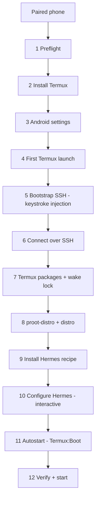

# M11 — New Phone Provisioning

**Goal:** Take a freshly paired phone (Wireless ADB only) to a running Hermes Agent from inside the app: Termux → SSH → proot-distro → Hermes → keep-alive.
**Scheduled:** after M6, before the M10 release (milestone IDs are stable; see MILESTONES.md for order).
**Depends on:** M4 (Termux bridge), M5 (environment wrapper, detection), M6-T8 (interactive PTY), M0-S4 spike. ADR-014.

## Implementation Status

Local implementation snapshot (2026-10-07): the typed plan runner, consent/phone-action pauses,
single-step execution, cancellation tokens, stable-device progress with completion timestamps,
validated bundled/user recipes, verified APK selection, concrete Android/SSH steps, Device-page
wizard, and form/raw-TOML editor are implemented. The SSH bridge and editor are locally complete;
the remaining tickets are in progress, not completed acceptance criteria.

Verification: 233 Rust tests, 101 frontend tests, and 21 control-service Python tests pass;
TypeScript, ESLint, strict all-target Clippy, Rust/touched-file formatting, synchronized
versions, and the production frontend build pass. Repository-wide Prettier still reports
pre-existing unrelated files and scans Python virtualenv/cache contents. No factory-reset, APK installation,
phone settings mutation, or reboot test was performed for this milestone.

ADB-installed F-Droid Termux builds are recognized through a stable-device receipt only
when the installed APK digest matches the verified download. Replacement APKs do not inherit
that provenance. APK downloads enforce a 100 MiB limit while reading response chunks.

Remaining implementation and acceptance work:
- T1: exercise cancellation during long downloads/SSH commands and recover from disconnect/app exit;
  cancellation is currently checked between operations, not guaranteed to interrupt every operation immediately.
- T2/T14: persist and consume recipe-derived HermesConfig per phone after success. M9's profile
  boundary is not implemented; changing the global config would incorrectly affect other phones.
- T2/T11: native APT installation safely pauses for manual repository setup because no verified
  repository URL is bundled; fingerprint validation is not repository installation/verification.
- T3: recipe-configurable storage threshold (GiB, default 2) and typed-confirmation uninstall
  are implemented. Factory-phone uninstall/preflight verification remains.
- T4: minimum installed/downloaded Termux versions are enforced with SemVer; APK downloads now
  report bounded progress through the provisioning output stream; common Android package install
  errors include actionable guidance while preserving OEM output in Details. Unrecognized OEM
  errors, source/plugin compatibility QA, and phone acceptance remain.
- T5: optional storage/notification grants and battery/phantom-process commands are selected by
  Android SDK and covered by command tests; runtime permission outcomes remain phone QA.
- T6: launch now wakes the display, requires explicit awake/unlocked dumpsys state, and waits up
  to 20 seconds for Termux focus with cancellation. Device/OEM runtime verification remains.
- T7: foreground checks, stale-status clearing, marker polling, and no-marker retry exist. Local
  bootstrap script/public-key files and the shared handoff directory are now cleaned on every
  outcome; remote cleanup failures are logged without masking the original error. Test escaping,
  marker/retry behavior, and interruption cleanup on real phones. No private key is copied.
- T9: Termux package and wake-lock commands now stream stdout/stderr and propagate cancellation
  and exit status. Connected-phone streaming verification remains.
- T10: reruns now skip distro installation when the selected distro is listed and reapply its
  package set idempotently. Partial-rootfs repair and connected-phone verification remain open.
- T11: the wizard can review installer size, SHA-256, and contents, then separately approve and
  run the script in the selected environment's interactive PTY. Binary PATH discovery and
  phone/install acceptance remain.
- T12: interactive configuration avoids persistent terminal history; the wizard offers
  `hermes setup --portal`, explains proot/systemd and gateway access, and surfaces successful
  `hermes doctor` warnings without failing setup. Masked atomic config-file fallback and
  phone/install acceptance remain.
- T13/T14: same-source Termux:Boot resolver/installation, activation and boot hook exist; verify
  signatures, detached supervisor behavior, reboot recovery, readiness/log output, and per-phone save.
- T15: Device-page wizard supports consent/run-step/cancel/resume/output; Overview/onboarding entry
  points, exhaustive step-state/resume tests, and responsive runtime QA remain.
- T16: form/raw TOML, backend validation, duplication, import and export are implemented. Native
  file-picker import/export interaction still needs runtime QA.

All physical-device exit checks below remain open.

## Principles
- **Check, then act.** Every step has `check()` (already done? → skip) and `run()`. Re-running is always safe; a half-set-up phone can resume.
- **Transparent.** Each step shows the exact commands and streams their output; user can stop anytime.
- **Explicit consent** for anything that changes system settings, installs/uninstalls apps, or downloads large files.
- **No secrets** in setup scripts, files on shared storage, or logs. API keys only enter through the Hermes configuration step.
- **Nothing hard-coded about Hermes**: install/configure commands come from an editable recipe.

## Flow



## Backend

### [~] M11-T1 Provisioning engine (`provision/`)
```rust
#[async_trait]
pub trait ProvisionStep: Send + Sync {
    fn id(&self) -> StepId;
    fn title(&self) -> &str;
    fn requires_consent(&self) -> Option<ConsentRequest>;   // what will change, exact commands
    fn phone_action(&self) -> Option<PhoneAction>;          // "Unlock phone", "Accept install prompt"
    async fn check(&self, ctx: &ProvisionCtx) -> Result<StepState, AppError>; // Done | Todo | Blocked(reason)
    async fn run(&self, ctx: &ProvisionCtx, events: &Channel<ProvisionEvent>) -> Result<(), AppError>;
}
```
- `ProvisionPlan` = ordered steps; runner executes sequentially, stops on failure, supports cancel (`StreamRegistry`) and resume.
- Progress persisted per `device_id` (completed steps, timestamps, last error).
- Events: `StepStarted`, `Output(StreamEvent)`, `PhoneActionNeeded`, `StepDone`, `StepFailed(AppError)`, `PlanDone`.
- Commands: `get_provision_plan(serial, recipe_id)`, `run_provision(serial, from_step, on_event)`, `cancel_provision`, `reset_provision_progress`.
- Different phones may be set up in parallel; one plan per phone at a time.
- **Tests:** plan skips Done steps; stops on failure; resume from failed step; cancel; persisted progress.

### [~] M11-T2 Recipes (`provision/recipe.rs`)
Default recipe — Debian proot + the official Hermes installer (`https://hermes-agent.nousresearch.com/install.sh`):
```toml
id = "debian-official"
name = "Debian (proot) + official Hermes installer"
termux_source = "fdroid"            # fdroid | github — Termux + plugins must share one source
distro = "debian"
termux_packages = ["openssh", "termux-services", "util-linux", "proot-distro"]
distro_packages = ["curl", "ca-certificates", "git"]   # installer brings its own Python/Node via its package manager

[hermes_install]
script_url = "https://hermes-agent.nousresearch.com/install.sh"
interactive = true                  # run in a PTY in case the installer prompts (confirm in M0-S4)

[hermes_configure]
steps = ["hermes setup", "hermes gateway setup"]   # interactive, in PTY

[hermes_runtime]                    # becomes the phone's HermesConfig
start_mode = "supervised"           # no systemd in proot (ADR-015)
gateway_command = "hermes gateway run"
process_match = "hermes gateway run"
status_commands = ["hermes gateway status", "hermes status"]
version_command = "hermes --version"
doctor_command = "hermes doctor"
update_command = "hermes update"
log_files = ["~/.hermes/logs/gateway.log", "~/.hermes/logs/tool_calls.log"]
state_file = "~/.hermes/gateway_state.json"   # location confirmed in M0-S2

autostart = true
```
Alternative recipe `termux-native-apt` (marked **experimental**: the upstream Termux package is currently reported broken): adds the Hermes APT repo with key fingerprint pinned to `C572 B5FD D1A2 9CCF A9A9 12B6 840B 0848 E139 156D` (abort on mismatch), `pkg install hermes-agent`, environment `Termux`, aarch64 only.
- Bundled recipes + user recipes (create/edit/duplicate/import/export TOML).
- Validation: distro name `[a-z0-9_-]+`, package names `[a-z0-9.+-]+`, `script_url` must be `https://`.
- Recipe applied fills `HermesConfig` (environment, commands, log files) after success.
- **Tests:** parse both bundled recipes, validate, round-trip, invalid values.

### [~] M11-T3 Step 1 — Preflight
- ADB connected & authorized; Android version; ABI (`ro.product.cpu.abi`); free storage ≥ 2 GB (configurable); Wi-Fi; existing Termux (M2-T5b).
- Existing Termux from Google Play → Blocked: explain it must be replaced; offer uninstall **only** with typed confirmation (deletes Termux data).
- Existing Termux from a different source than the recipe → Blocked with explanation (signature mismatch with plugins).

### [~] M11-T4 Step 2 — Install Termux (+ Termux:Boot if `autostart`)
- Resolve latest release from the recipe source (F-Droid index / GitHub Releases API), pick APK for the phone ABI (universal fallback).
- Download to app cache with progress; verify SHA-256 against source metadata; abort on mismatch.
- `adb -s S install -r <apk>`; surface OEM prompts (`PhoneActionNeeded: "Allow install on phone"`); map `INSTALL_FAILED_*` to clear errors.
- Check: package present with version ≥ recipe minimum.
- **Tests:** ABI → asset selection, checksum mismatch, install error mapping.

### [~] M11-T5 Step 3 — Android settings (consent required)
- `pm grant com.termux android.permission.READ_EXTERNAL_STORAGE` / `WRITE_EXTERNAL_STORAGE` (needed for bootstrap handoff), `POST_NOTIFICATIONS` (Android 13+).
- Battery: `dumpsys deviceidle whitelist +com.termux`.
- Phantom process killer: Android 12–13 `device_config set_sync_disabled_for_tests persistent` + `device_config put activity_manager max_phantom_processes 2147483647`; Android 14+ `settings put global settings_enable_monitor_phantom_procs false`.
- Report each item applied / not supported / failed — never fail the plan for an optional item.
- **Tests:** command selection per Android version; partial failure reporting.

### [~] M11-T6 Step 4 — First Termux launch
- Wake + check unlocked (`dumpsys power`, `dumpsys window` keyguard state); `PhoneActionNeeded: "Unlock your phone"` until unlocked.
- `am start -n com.termux/.app.TermuxActivity`; wait for focus (`dumpsys window | grep mCurrentFocus`) and bootstrap time.

### [~] M11-T7 Step 5 — Bootstrap SSH (keystroke handoff)
- `adb push` to `/sdcard/Download/hacc/`: `bootstrap.sh` + app public key (no secrets).
- Ensure Termux focused + unlocked, then `adb shell input text "sh%s/sdcard/Download/hacc/bootstrap.sh"` + `input keyevent 66`.
- `bootstrap.sh` (idempotent, non-interactive: `DEBIAN_FRONTEND=noninteractive`, `-o Dpkg::Options::=--force-confold`, `yes |` for pkg): installs `openssh`, appends key to `~/.ssh/authorized_keys` if absent (perms 700/600), sets `ListenAddress 127.0.0.1`, starts `sshd`, writes progress markers to `/sdcard/Download/hacc/status`.
- App polls the status file via `adb shell cat` (every 1 s, time-limited 10 min) → progress events; no marker within 20 s → re-check focus and retype once.
- On success delete `/sdcard/Download/hacc/`.
- **Tests:** `input text` escaping (`%s`, special chars rejected), status marker parsing, retry logic.

### [x] M11-T8 Step 6 — Connect over SSH
- Reuse M4 (forward + `TermuxSshTransport`, TOFU host key). From here every step uses SSH with full stdout/stderr/exit codes.

### [~] M11-T9 Step 7 — Termux packages + wake lock
- `pkg install -y` recipe `termux_packages` (skip installed: `dpkg -s`); `sv-enable sshd`; `termux-wake-lock`.

### [~] M11-T10 Step 8 — proot-distro + distro
- Skip if `installed-rootfs/<distro>` exists; else `proot-distro install <distro>` with streamed progress (large download — consent shows estimated size).
- Inside distro: `apt-get update && apt-get install -y <distro_packages>` via the M5 wrapper.

### [~] M11-T11 Step 9 — Install Hermes
- Check first: `detect_hermes` finds Hermes in Debian → Done (offer `hermes update` instead).
- Download inside the distro instead of piping: `curl -fsSL <script_url> -o /tmp/hermes-install.sh`; show size + SHA-256 + "View script" in the consent dialog; then `bash /tmp/hermes-install.sh` (PTY if `interactive`). Equivalent to the official `curl … | bash`, but reviewable.
- The installer adds Hermes to the shell profile; non-interactive `bash -lc` may not see it. After install resolve the binary once (`bash -ic 'command -v hermes'`) and store its directory in the environment's `path_prepend` (M5-T1a).
- Check: `hermes --version` succeeds via the wrapper.

### [~] M11-T12 Step 10 — Configure Hermes
- Run each `hermes_configure.steps` command in an interactive PTY (M6-T8) inside Debian: `hermes setup` (provider/model/keys; `hermes setup --portal` also offered) then `hermes gateway setup` (Telegram etc.). Output is **not** persisted or logged.
- Hint panel beside the PTY: "If asked to install or start the gateway service, choose **No** — there is no systemd in proot; the app supervises the gateway." Also reminds that the gateway only answers allow-listed / DM-paired users.
- Fallback: config file editor for `~/.hermes/config.yaml` (fetch via SSH, edit, write back atomically, mode 600; secret-looking values masked).
- Check: `hermes doctor` exits 0 (warnings shown, not fatal).

### [~] M11-T13 Step 11 — Autostart (if `autostart`)
- Write `~/.termux/boot/10-hermes`: `termux-wake-lock`, `sshd`, then launch the gateway supervisor (M5-T1c) detached.
- Activate Termux:Boot once: `am start -n com.termux.boot/.BootActivity`.
- Check: script present + executable, Termux:Boot installed.

### [~] M11-T14 Step 12 — Verify + start
- Run Termux check (M4-T4), Hermes detection, start Hermes, wait for Running, stream first log lines; save `HermesConfig` into the phone's profile (M9).

## Frontend

### [~] M11-T15 "Set up new phone" wizard
- Entry points: no-devices / new-device screen ("This phone has no Termux — Set up automatically?"), Device page, Overview card.
- Recipe picker (+ edit), plan list with per-step state (✓ Done · ○ To do · ⏳ Running · ⚠ Phone action · ✗ Failed · ⛔ Blocked), consent dialogs listing exact commands, live output pane, Run all / Run step / Cancel / Resume.
- Prominent phone-action banner ("Unlock your phone and keep Termux open").
- **Tests:** each step state renders; consent required before consent steps; resume shows completed steps as done.

### [x] M11-T16 Recipe editor
- Form + raw TOML view, validation errors inline, import/export.

## Exit check
- [ ] Factory-fresh phone (Android 13 and 14+): pair → wizard → Hermes running in proot-distro, with only these phone interactions: unlock, OEM install prompt (if any), Hermes secrets entry.
- [ ] Re-running the wizard on the finished phone marks every step Done and changes nothing.
- [ ] Interrupting at each step (cancel, Wi-Fi drop, app quit) and resuming completes successfully.
- [ ] Reboot phone → Hermes comes back via Termux:Boot.
- [ ] No files left in `/sdcard/Download/hacc/`; no secrets in app logs.
